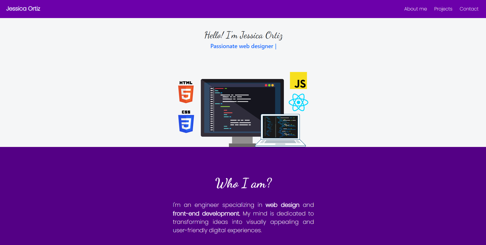
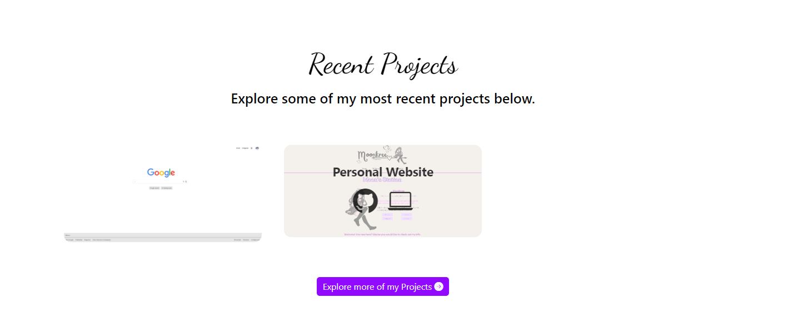
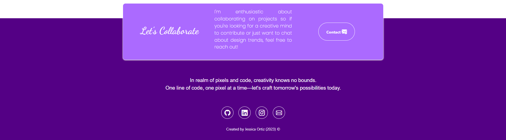

# Portafolio Adaptable (Responsive) con Bootstrap 5

## ENGLISH VERSION

This project was crafted for the Tecnolochicas PRO bootcamp, presenting a website that adapts seamlessly to various device sizes, commonly known as a "responsive" design.

The purpose of this website is to showcase the portfolio of projects completed during the bootcamp and to serve as a platform for future endeavors. It encompasses a brief introduction about myself, highlights of projects, and convenient contact options. Additionally, a JavaScript-powered typing animation enhances the visual appeal of the webpage.

### Screenshots:
First section of the webpage:

Projects:

Contact:

### Technologies
This webpage was built using:

HTML
CSS
JavaScript
Bootstrap 5
Furthermore, it incorporates Google Fonts for a customized typeface and Bootstrap icons to integrate symbols like arrows and logos of popular social networks.

### Language
The content of the webpage, including classes, custom attributes, and Bootstrap-related classes are written in English.

## VERSIÓN EN ESPAÑOL

Este proyecto fue creado para el bootcamp Tecnolochicas PRO, es una página web adaptable a dispositivos de distintos tamaños (este tipo de sitio web se conoce en inglés como "responsive"). 

El propósito de esta página web es mostrar el portafolio de proyectos realizados en el bootcamp asì como poder usarlo para los proyectos futuros. Incluye una descripción sobre quien soy, proyectos, y formas de contacto. Además incluyte una animación a la escritura de la página web con JavaScript.

### Capturas de pantalla:

Primera parte de la página web:

Proyectos:

Contacto:

## Tecnologías

Esta página web fue creada con:

* HTML
* CSS
* JavaScript 
* Bootstrap 5

Además, se incluyeron **Google Fonts** para personalizar la fuente y **Bootstrap icons** para incorporar íconos como flechas y logos de redes sociales populares. 

## Español

El texto de la página web está escrito en español, al igual que las clases y atributos personalizados. Las clases relacionadas con Bootstrap se incluyeron en inglés.

